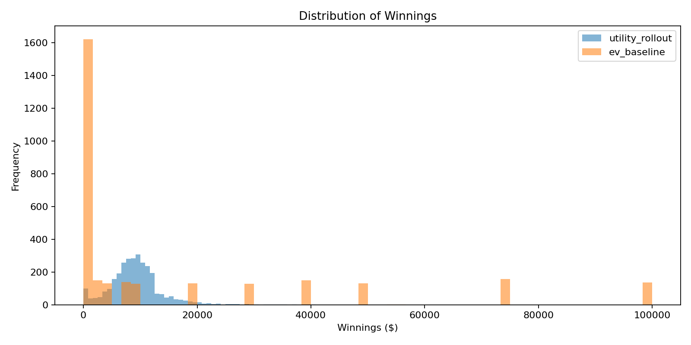
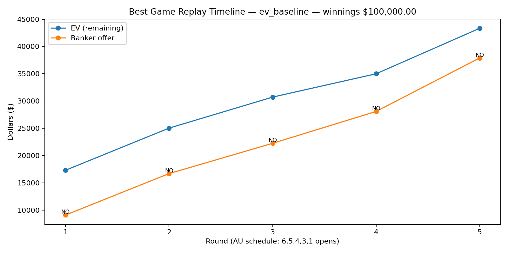

# Deal or No Deal Australia — Deal Fairness & Decision Modeling

A simulation-based analysis of **Deal or No Deal (Australia rules)** that asks a simple but hard question:

> **When is a Deal objectively a good deal?**

This project models contestant decision-making using:
- expected value (EV),
- risk aversion (CARA utility),
- loss aversion (reference-point effects),
- and Monte Carlo lookahead that preserves the contestant’s chosen case.

The result is a **Deal Fairness Index (DFI)** that quantifies how good or bad a banker offer is for a given contestant profile.

---


## 🎯 What this project does

The simulator compares two strategies:

### 1️⃣ EV baseline (risk-neutral)
- Take the Deal if:
Offer ≥ EV(remaining cases)

markdown
Copy code
- Maximises average winnings
- Produces extreme outcomes (very high variance)
- Rarely matches real TV behaviour

### 2️⃣ Utility rollout (human-realistic)
- Take the Deal if:
U(Offer) ≥ E[U(Continue)]

yaml
Copy code
- Uses CARA utility to model risk aversion
- Optional loss aversion using a reference point (e.g. last offer)
- Uses Monte Carlo lookahead where the contestant’s chosen case remains fixed
- Produces earlier deals and TV-like outcomes

---

## 📊 Deal Fairness Index (DFI)

For each banker offer:

DFI = Offer / CertaintyEquivalent

vbnet
Copy code

Where the certainty equivalent (CE) is computed from CARA utility:

CE = -R * ln( E[ exp(-X / R) ] )

yaml
Copy code

Interpretation:
- **DFI < 0.85** → Bad deal
- **0.85–1.15** → Fair / borderline
- **> 1.15** → Good to great deal (for that risk profile)

This makes “good deal” **explicit, quantitative, and contestant-specific**.

---

## 🇦🇺 Game rules modelled

- **Australian prize set** (22 cases)
- Opening schedule: **6, 5, 4, 3, 1**
- No case swapping
- Banker offers based on remaining EV with round-dependent generosity
- Final outcome is the value in the contestant’s chosen case

---
## 📊 Example Results

### Win Distribution (EV baseline vs utility-aware strategy)



This histogram compares outcomes from a pure expected-value strategy versus
a utility-aware (risk- and loss-averse) rollout strategy.  
The EV strategy produces higher variance and rare big wins, while the
utility-aware strategy concentrates outcomes in a safer, more TV-realistic range.

---

### Best Game Replay (Utility-aware strategy)



This timeline shows a single high-performing game, plotting remaining expected
value against banker offers across rounds.  
Annotations show when **NO DEAL** decisions were made under the model.


## ▶️ How to run

### Baseline EV strategy
```bash
python dond_au_lookahead_replay.py \
  --trials 3000 \
  --lookahead_sims 0 \
  --out outputs/dond_ev
Utility rollout (moderate risk tolerance)
bash
Copy code
python dond_au_lookahead_replay.py \
  --trials 3000 \
  --lookahead_sims 120 \
  --risk_tolerance 30000 \
  --loss_aversion 2.0 \
  --ref_mode last_offer \
  --out outputs/dond_util
“Gambler” profile
bash
Copy code
python dond_au_lookahead_replay.py \
  --trials 3000 \
  --lookahead_sims 120 \
  --risk_tolerance 80000 \
  --loss_aversion 2.0 \
  --ref_mode last_offer \
  --out outputs/dond_R80k
📂 Outputs
Each run produces:

*_raw.csv — trial-level results

*_summary.csv — descriptive statistics

*_win_distribution.png

*_deal_timing.png

*_best_replay.json

*_best_replay_timeline.png

These allow full post-hoc analysis and replay of the best game.

🧠 Key findings
EV-only play maximises mean winnings but produces extreme downside risk.

Utility-based decisions align far better with real contestant behaviour.

Banker offers often become “objectively good” well before EV parity once risk and loss aversion are accounted for.

The Deal Fairness Index provides a clean, interpretable decision rule.


⚠️ Limitations
Banker behaviour is approximated, not reverse-engineered from TV data.

Utility parameters are stylised (but tunable).

This is a decision model, not a psychological claim.

📜 License
MIT License — free to use, modify, and extend.

✍️ Author
Ashley Vernon

Simulation decision-theory applied-modeling